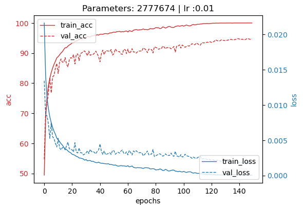

## DEEP LEARNING MINI-PROJECT:

### Team Members:
1) Deepti Preta Gouthaman
2) Nobel Dang
3) Shivansh Sharma

# **ResNet-Lite (<5 Million Parameters)**

This project is aimed at improving ResNet accuracy on CIFAR10 dataset while keeping the model parameters under 5 million. The project is fully modular and device agnostic in design. There are multiple optional arguments to help you debug and perform experiments.

> Best Accuracy: **94.85 %**

> Parameters: **2,777,674**

<p align="center">
  
  <br/>
  Training History of Best Model
</p>


---
## **Project Stucture**

|Directory / File     | Description                                 |
|---------------------|---------------------------------------------|
|`checkpoints`        | Contains the saved network states           |
|`docs`               | Project documentaion                        |
|`results`            | Saved histroy and plots                     |
|`main.py`            | Main file for execution                     |
|`resnet.py`          | Resnet definitions and model configuartion  |
|`utils.py`           | Utility function                            |

---
## **Run options**

To get help execute -
```bash
python resnet.py --help
```

**Optional Arguments:**
| Arguments                | Description                                  | Default
|--------------------------|----------------------------------------------|-----------------
| --help                   | Show this help message and exit              |
| --mname                  | Model Name for logging purpose               | None (Required)
| --lr                     | Learning Rate                                | 0.01
| --resume                 | Resume Training                              | False
| --epochs                 | No. of training epochs                       | 50
| --batch_size             | Batch Size for Training Data                 | 128
| --val_batch_size         | Batch Size for Validation Data               | 100
| --optimz                 | Optimizer: 'sgd', 'adam', 'adadelta'         | 'sgd'
| --model                  | Model: 'ResNet10', 'ResNet14', 'ResNet14_v2' | 'ResNet14'
| --wd                     | Weight decay for l2 regularization           | 5e-4
| --do_annealing           | Enable Cosine Annealing                      | False
| --overwrite              | Overwrite the existing model (mname)         | False


**Usage**
```bash
python main.py --mname {str} [--help] [--lr {float}] [--resume] [--epochs {int}] [--optimz {str}] [--model {str}] [--wd {float}] [--do_annealing] [--overwrite] [--batch_size {int}] [--val_batch_size {int}]
```
---
## **How to run**

1. To start training with best model configuration for 100 epochs execute the following command -
    ```bash
    python main.py --epochs 150 -optimz 'sgd' --do_annealing --batch_size 64 --model 'ResNet14' --mname `<model_name>` 
    ```

2. To resume training  for 50 epochs from best state checkpoint -
    ```bash
    python main.py --epochs 50 -optimz 'sgd' --do_annealing --batch_size 64 --model 'ResNet14' --mname 'model13' --resume
    ```

    > Replace `<model_name>` with your choice of model name.

</br>

---
## **Documentation**

1. Logs maintained at this [Google Sheet](https://docs.google.com/spreadsheets/d/1nRBr6NUiwAlOIIo7suecOdHwUBimqH-jmur7WVYfs0w/edit?usp=sharing)
2. Our team project report: [here](https://github.com/nobeldang/deep-learning-resnet-CIFAR10/blob/main/docs/report_mini_proj.pdf)

